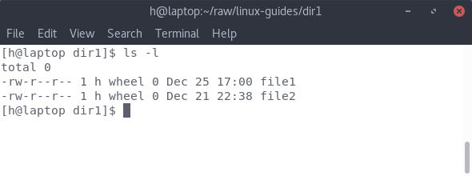
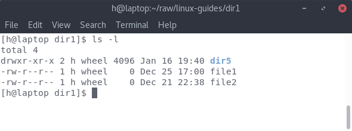
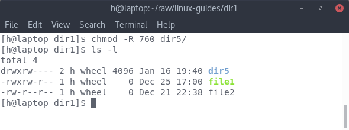

# File Permissions

## What are file permissions?

Linux follows the Unix philosophy of "everything is a file" pretty extensively. So obviously, setting limits on who can read, write or execute files is a pretty important thing. You don't want some random user to be able to make changes to the core system by modifying important files. That's why linux has file permissions. 

In linux, there are 3 permissions:

1. Permission to read a file
2. Permission to write/modify a file
3. Permission to execute a file as a binary


If you have typed the command ```ls -l``` to look at the contents of a directory, you'll get something like this:



So in this, you'll see this: ```-rw-r--r--``` What's this garbage?

Those are the permissions of the file. 

This text has 4 parts:

1. The first character indicates whether this is a file or a directory. If it's the former, it's a ```-```. If it's the latter,it's a ```d```.
2. The next 3 characters show the permissions for the user that owns the file.
3. The next 3 characters show the permissions for the group that the user is part of.
4. Finally, the last 3 characters show the permissions for everyone that is not the owner of the file

Now we come to the actual characters. These define what the actual permissions are:

| Character | Permission |
| --------- | ---------- |
| ```r```   | Read       |
| ```w```   | Write      |
| ```x```   | Execute    |

So if you put these 2 things together, you can find out the permissions of the file. 

So in this screenshot,



1. The directory ```dir5``` is readable, writable, and executable by the owner. It's readable and executable by other users in the group, or anyone else
2. The file ```file1``` is readable and writable by the owner. It's only readable by others in the same group, or anyone else. 

---

**Note: File permissions are not implicitly recursive. So just because ```dir5``` can be read by anyone, the contents of ```dir5``` may not be readable by everyone.**

---

## Changing the permissions of a file/directory

Ok so, in the above screenshot, what if you want to execute ```file1``` like a program? Well, you have to change the permission, with the ```chmod``` command. 

The ```chmod```  command has a specific syntax for denoting permissions. Without going into the octal number system, here are the symbols:

| Permission | Symbol |
| ---------- | ------ |
| Read       | 4      |
| Write      | 2      |
| Execute    | 1      |

This is the syntax for the ```chmod``` command:

```bash
chmod xxx filename
```

The ```x```'s are the sum of all the permissions you want to give to the user/group/everyone. 

So for example: 

1. Read and Write - 4 + 2 = 6
2. Read, Write and Execute - 4 + 2 + 1 = 7
3. Read and execute - 4 + 1 = 5
4. Just read - 4
5. No access - 0

Here's an example: 


In this case, we passed the number ```764```. This means that we want to set the permissions to:

1. Read, Write and Execute for the owner. (4 + 2 + 1 = 7)
2. Read and Write for any user that is in the same group as the owner (4+2 = 6)
3. Only read for everyone else (Read = 4)

Here's another example: 



In this case, we used the ```-R``` flag to make it recursive ie. all files/directories inside ```dir5``` have the same permissions as ```dir5``` itself. In this case, we passed ```760```:

1. Read, Write and Execute for the owner. (4 + 2 + 1 = 7)
2. Read and Write for any user that is in the same group as the owner (4+2 = 6)
3. Everyone else has no access to the directory. 
