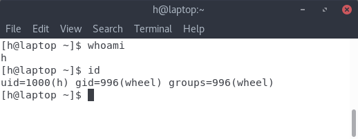
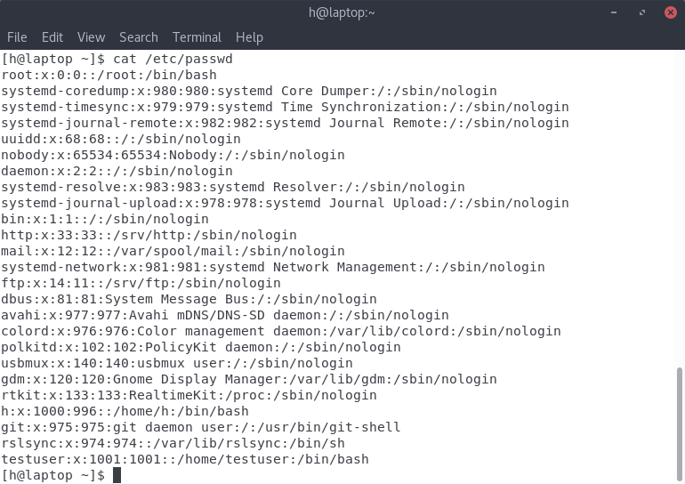
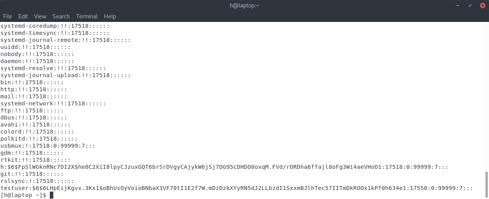
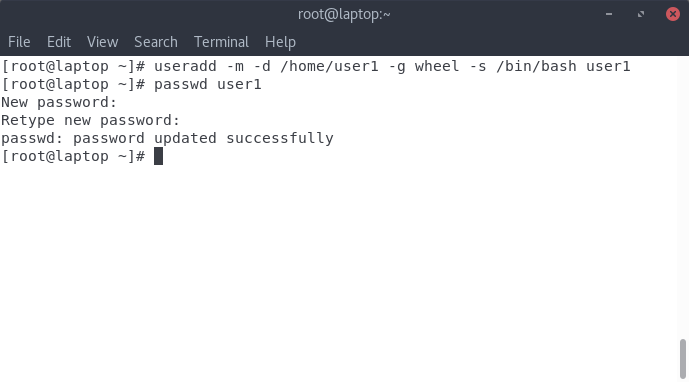
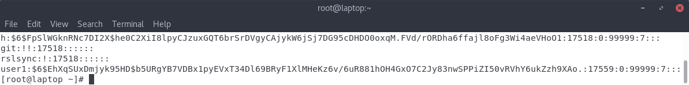
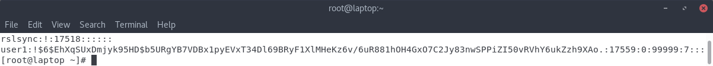
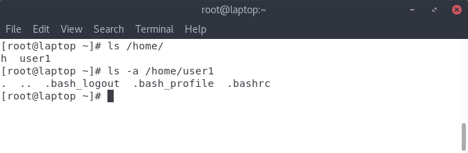
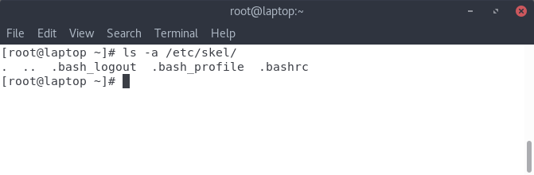
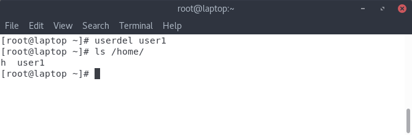
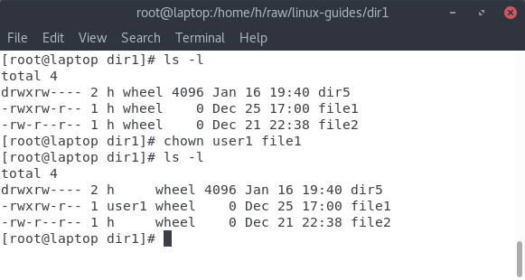

# Linux Command Line Tutorial #5 - User Management

In the last tutorial, I briefly mentioned files or directories having **owners**. In this part, we'll look at the owners, ie. users themselves. 

## What's a user? (in the Linux context?)

A user is a separate account on the system with it's own home directory and it's own permissions. **The whole Linux system revolves around the idea of a multi-user environment.** Basically, the Linux system is designed to be used by multiple people simultaneously, each having their own user accounts, and thus, their own reserved space in the file hierarchy so that one user can't access the other's data.

A user account has it's own space in the file hierarchy, it's own permissions and in some systems, it's own quota of the system resources(things like CPU time, memory and hard disk space). 

### What's a group?

A group is a collection of users, generally having some special property. One of things groups are used for is  access to hardware. So for example, if you want to use the printer, you may have to add your user to the printing group so it gets access to printers.

I won't go in to a lot of detail about groups in this tutorial, but i'll show basic stuff like adding yourself to a group.  

### What user am I?

If you're wondering what user account you're logged into, you can use the ```whoami``` command. Or, for more detail, you can use the ```id``` command. 

<center>

</center>

If you look at the output of ```whoami```, you'll see that i'm logged in to the user ```h```. The output of the ```id``` command gives us more information. According to this, you'll see that i am user ```h```, with a ```userid``` of 1000. I'm also part of group ```wheel```, which has a ```groupid``` of 996. 

### What is the userid and groupid?

They are quite literally, the id of the users/groups. The user/groupid is what the system internally uses to identify and work with users and groups. The textual name is merely the human-readable id. userid and groupid is generally not really a used while managing a Linux system, so i won't go into a lot of detail about it.

##Where is information about users stored?

The 2 important files when it comes to users in linux are ```/etc/passwd``` and ```/etc/shadow```. We'll look at each of these files before we look at making and removing users.

### 1. /etc/passwd

<center></center>

If you look at the contents of the ```/etc/passwd``` file, you'll see a lot of text. Each line contains information about a separate user. We'll take the line that contains information about my user, and the u:

<center>```h:x:1000:996::/home/h:/bin/bash```</center>

If you see this line, you'll see that it's delineated by colons. We'll go through each of these parts:

1. ```h``` - this is the login name. Each user has a login name. 

2. ```x``` - This is (supposed to be) the hashed and salted password. But obviously, that's not the case. Because in most modern linux systems, the hashed password is now stored in the ```/etc/shadow``` file. 

3. ```1000``` - This is the ```userid```. It's 1000, as we saw above

4. ```996``` - It's the groupid. This is the id of the primary group that this user is the part of. 

5. **Nothing** - OK. so if you look past the groupid, you'll see that there are 2 colons with nothing in between them. But if you look at the line above, you'll see ```RealtimeKit``` at the same position. This is the actual name of the user. For example, while setting up an Ubuntu system, when adding a new user, you'll be asked for entering your name **besides** the username(ie. the login name). *That* is what's displayed in this field. 

6. ```/home/h``` - This is the home directory of the user. As i said above, in a linux system, every user account has it's own home directory. 

7. ```/bin/bash``` - This is the shell of the user. Generally, the shell is the ```bash``` shell, although there can also be other shells like ```ksh``` or ```zsh``` or ```fish```.


### 2. /etc/shadow

The ```/etc/shadow``` file on most linux systems contains the hashed and salted passwords of each user. 

<center></center>

So in this case, ```$6$FpSlWGknRNc7DI2X$he0C2XiI8lpyCJzuxGQT6brSrDVgyCAjykW6jSj7DG95cDHDO0oxqM.FVd/rORDha6ffajl8oFg3Wi4aeVHoO1```

is the salted hash of my password. 

(If you don't know what hashing and salting is, google it. It's also used while storing website passwords)

## Adding and deleting users

You can add users using the ```useradd``` command.

<center></center>

So in this screenshot, we use the ```useradd``` command to make a new user ```user1```. We also do other stuff:

1. We make a home directory using the ```-m``` flag, and then specify it as ```/home/user1``` using the ```-d``` flag. 
2. We add it to the group ```wheel``` using the ```-g``` flag. 
3. We set the default shell to ```/bin/bash``` using the ```-s``` flag. 
4. Finally, we name the user ```user1```.

In this screenshot, we also set a new password for ```user1```. 

So if we check it in ```/etc/shadow```, you'll see this:

<center></center>

Now, if you look at the other users, you'll see that the user above - ```rslsync``` just has a ```!``` in place of the password hash. **That means it's a locked account, ie. you can't use it to login.**

If we want to lock it, we can use this command:  ```usermod -L user1```. After running that, this is what we get:

<center></center>

The ```!``` in front of the password hash indicates that it's a locked account. 

Now, if we check in the ```/home``` directory, we see this:

<center></center>

As expected, the home directory contains a directory for ```user1``` . But if we check inside that directory, we see a few files. Where did they come from? **They came from the ```/etc/skel``` directory.**

If we check inside ```/etc/skel```,

<center></center>

We see the same files. They are copied to the home directory everytime a new user is created.

Finally, you can delete users using the ```userdel``` command:

<center></center>

Running the ```userdel``` command deletes the user entry in ```/etc/passwd``` and ```/etc/shadow```. But if you look in the screenshot, **it doesn't delete the user's home directory.**

## Changing file ownership

Ok. So we have taken a look at user management. But let's say I have a file. How do i change the owner of that file?

You do that with the ```chown``` command. 

<center></center>

If you look at the output of  ```ls -l```, the 3rd column shows the owner of the file. So for example, the file ```file1``` has ```h``` as the owner. But after running the command ```chown user1 file1```, the owner changes to ```user1```. 
