# Linux Command Line Tutorial #6.1 - systemd

This is the first of a series of tutorials about systemd.

## So what is systemd?

```Systemd``` is the foundation of any modern linux system(other than the kernel, of course). When the Linux kernel finishes the initial boot process, the first process it starts is ```systemd```. Systemd then takes over further starting up of other services/applications. These days, systemd handles a lot of other stuff like mounting drives/devices, managing the network, containers etc. So if you want to manage a modern linux system, chances are you will have to have a good idea of what systemd is and does.

Systemd is pretty new( and so, relatively unproven) in the grand scheme of things. Before systemd, there were other "init systems" as they are known, like systemv,upstart and openrc. Systemv was the most popular of these(it has now been replaced by systemd in most distributions). 

### Wait a minute. What's a service?

A service(in the systemd context) is a pretty broad thing. It is generally a background process/processes started for a certain purpose. So for example, if you have a backup program that runs in the background, it probably has a systemd service that starts everyday to check for new files to backup.  

Systemd also has other things like: 

1. ```devices``` - the systemd representation of hardware devices like soundcards, USB controllers etc.
2. ```mount``` - these generally are virtual filesystems like the ```tmp``` directory, and the kernel debug filesystem.
3. ```slice``` - a slice is a group of processes. You can put resource limits on slices.
4. ```sockets``` - systemd sockets are different than traditional UNIX sockets. Each service has a socket. The main advantage of sockets is that instead of starting the whole service, you can start the socket, which is much lighter. This makes the system listen for any incoming calls for the service. Then, when the system gets a call on the socket for the first time, the service is started.
5. ```target``` - targets replace traditional runlevels. There are many more targets than there are runlevels, and multiple runlevels can be activated at the same time.
6. ```timer``` - timers replace cron jobs. Each service can have a timer that describes when and at what interval the service is to be started.

But in this part, we'll only look at basic service management and a few other things.

### Service management

Most systemd functions are accessed through the ```systemctl``` command. 

If you want to see all the running services(or ```units```, as they are also called) in the system, just type ```systemctl``` without any arguments.

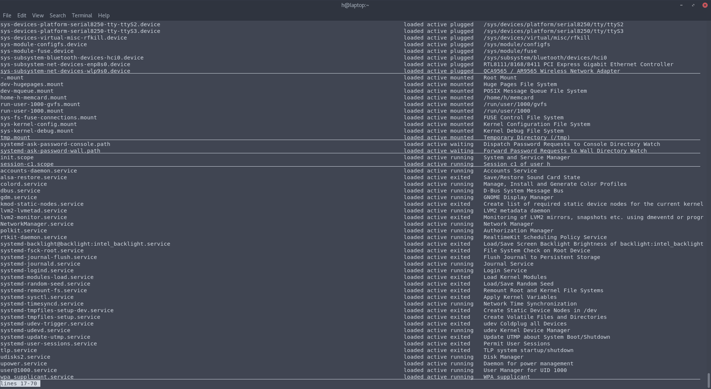

In this screenshot, you'll see all the running units in the system. You can see all the devices, and services.

If you want to look at just the failed units, you can run:

``` systemctl --failed``` 

In my case, there are no failed units.

<center>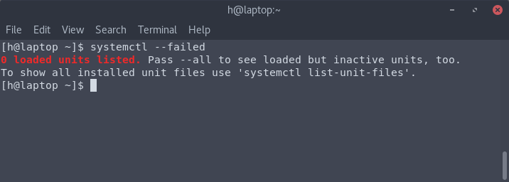</center>

Let's take a unit - ```NetworkManager```. and use it as an example to see some of the other commands that systemd has. The ```NetworkManager``` handles all networking related configuration.

To get some basic information about a service, you can use the ```status``` command, like so:

``` systemctl status NetworkManager``` 

<center>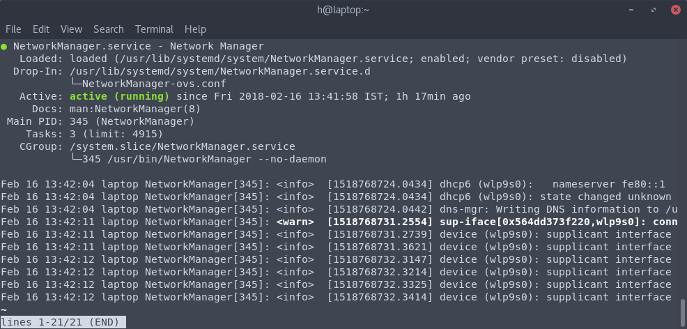</center> 

In this screenshot, we see a few things:

1. In the second line , we see that this service is ```enabled``` ie. it will automatically start on boot. 
2. In the third line, we see that the configuration file used to configure this service is called ```NetworkManager-ovs.conf``` and it's stored at ```/usr/lib/systemd/system/NetworkManager.service.d/```. Most service files that come out of the box with the system are stored in the ```/usr/lib/systemd/system/``` directory. 
3. In the fourth line, we see that the service is active, and we also see the exact time it was loaded.
4. On the next line, we see that it's documentation is available through the ```man``` command. 
5. On the next line, we see that it has a PID(Process ID) of 345.
6. We also can see a few log messages generated by the service.

To stop a service, use the ```stop``` command, like so:

<center>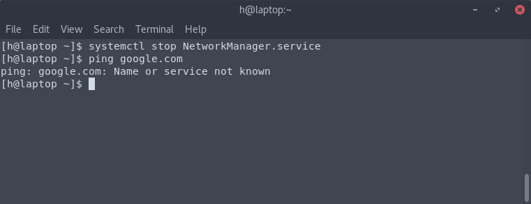</center>

As you can see, after it's stopped, i haz no internet. 

To start it again, use the ```start``` command:

<center>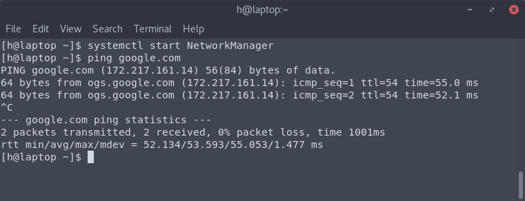</center>

NetworkManager is back up, and now i have internet again.

To enable a service(start it automatically at boot), use the ```enable``` command, like so:

```systemctl enable NetworkManager```

To disable something, use the disable command, like so:

```systemctl disable NetworkManager```

After disabling, if you look at the status,

<center>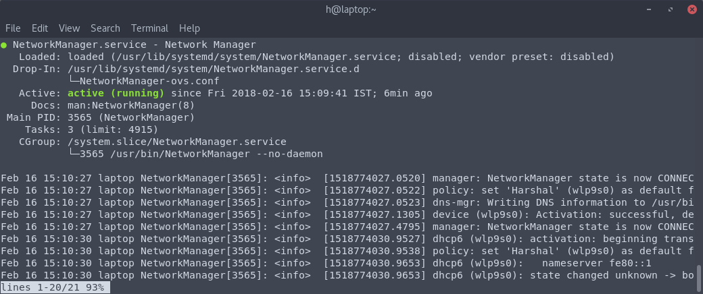</center>

On the second line, you'll see that the ```enabled``` in the previous status screenshot has been replaced by ```disabled```. Note how, after disabling the service, it's *still running.*

If you want to completely remove a service, you can use the ```mask``` command:

<center>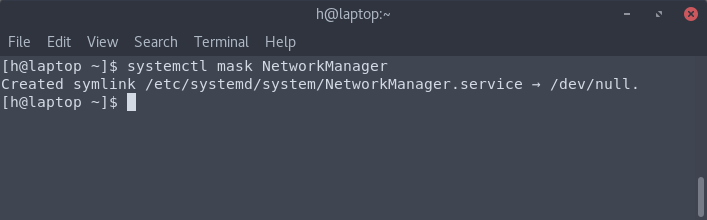</center>

To unmask it, simply use the ```unmask``` command:

<center>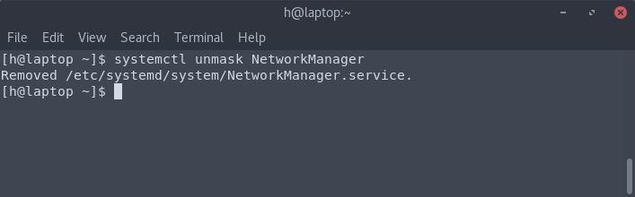</center>

### Using systemd for Power Management

To shutdown the system, you can use: 

```systemctl poweroff```

To reboot the system, you can use:

```systemctl reboot```

To suspend the system, you can use:

```systemctl suspend```

### Using systemd to troubleshoot boot times

So this is a feature of systemd that not a lot of people know about. It's pretty simple, so i'm going to show you how to use it in this part.

To look at the amount of time required for booting up, you can use ```systemd-analyze```, like so:

<center>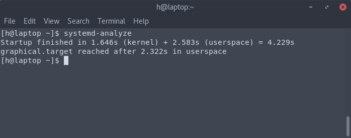</center>

So total boot time is around 4 seconds( if you are jealous of that, get an SSD ;-) ). Also, it took 2.322 seconds for ```graphical.target```(ie. the desktop) to start. 

These numbers exclude the time required for the BIOS to boot up. But if you have a UEFI system, you'll also see the amount of time taken by that. 

If you want to see the time taken to start each service, you can use the ```blame``` command:

<center>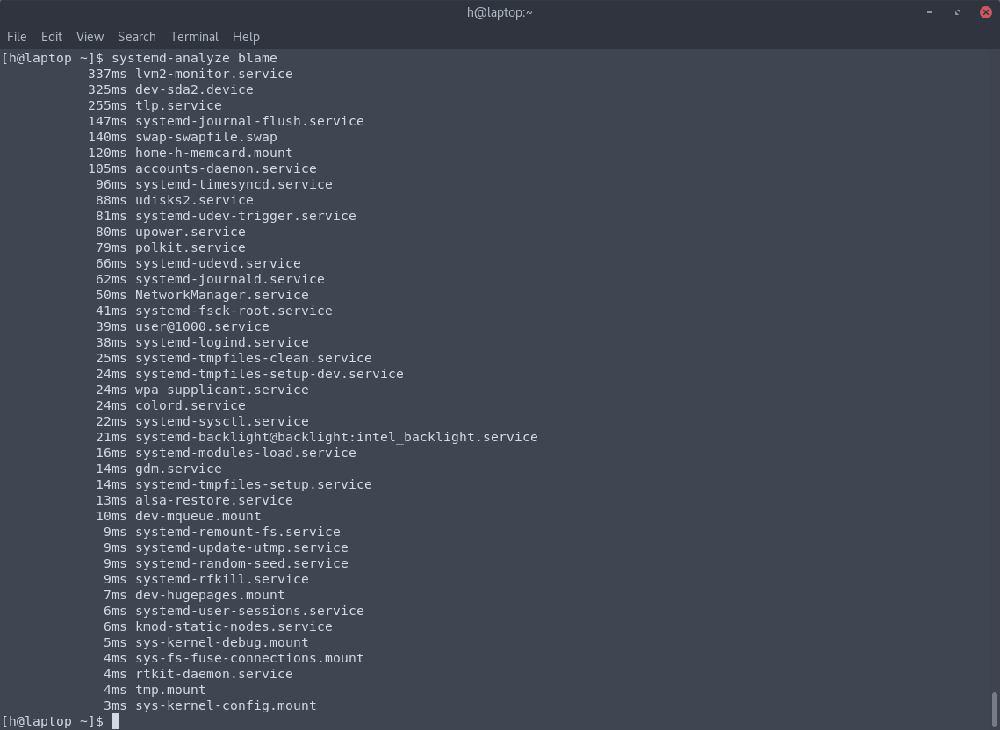</center>

In this screenshot, we can see the the amount of time taken for each service to start up. So if you are experiencing slow boot times, you can use this command to find out which service is taking the most amount of time to start up. 

If you want even more detail, you can use the ```plot``` command, which outputs an ```svg``` image, and pipe the output into a file like this:

```systemd-analyze plot > Pictures/boot.svg```

I'm not going to upload the actual image because it's really big, but this is a screenshot of a part of that image:

<center>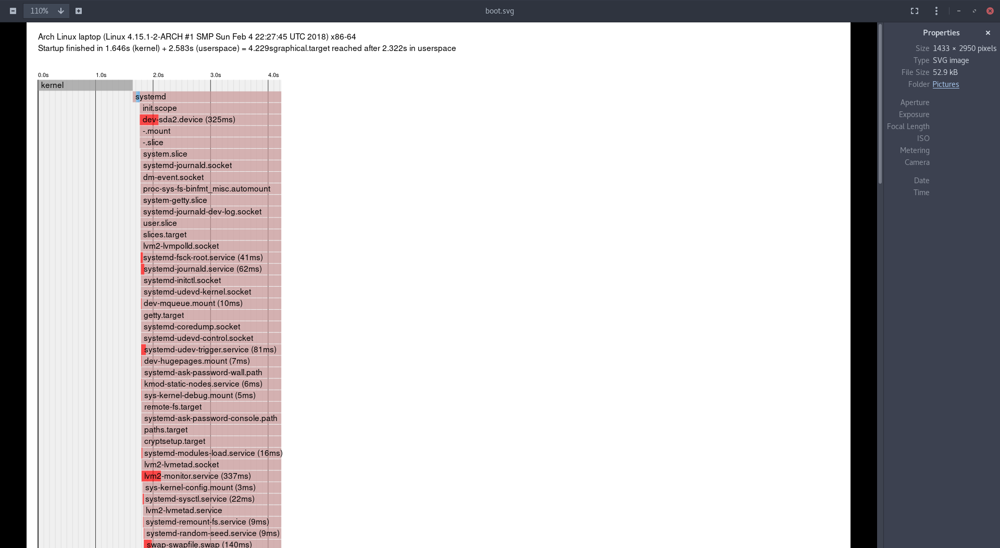</center>

This shows the amount of time taken by each and every service that got activated on system boot.This can actually be very useful for troubleshooting boot times.
